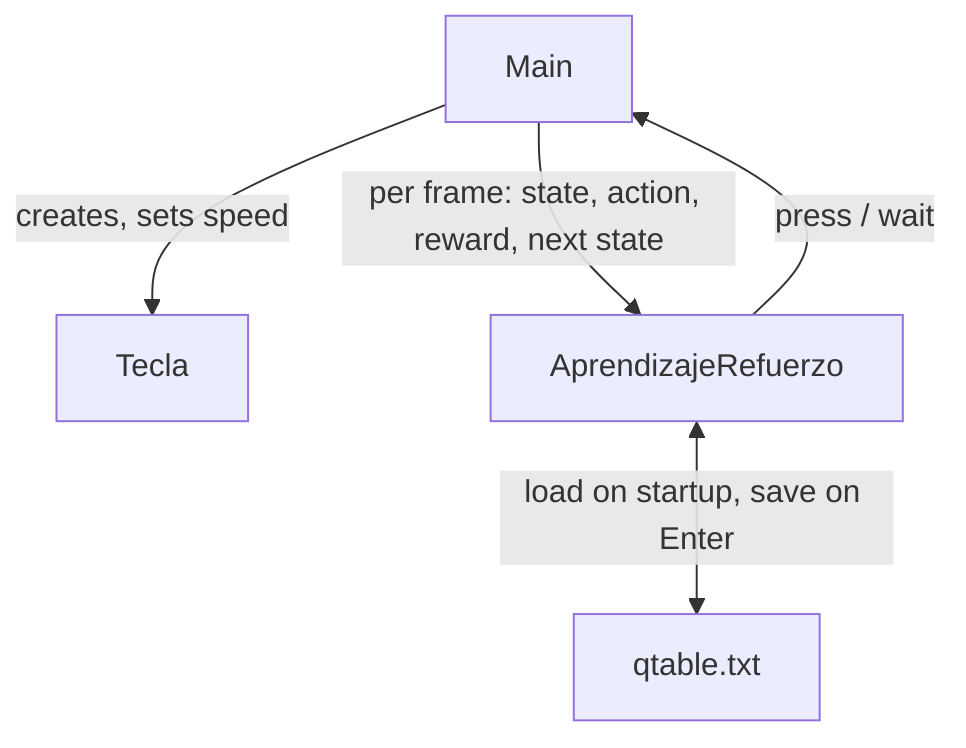

# Architecture

Three classes. `Main` is the Processing sketch (the game and the on-screen panel),
`AprendizajeRefuerzo` is the Q-learning agent, and `Tecla` is a single falling tile.



## The loop

Every frame, for every tile that is still active (`Main.actualizarYDibujarTeclas`):

1. **State.** `obtenerIndiceZona` turns the tile's Y position into a zone index 0–5 by distance
   from the press line. Combined with the tile type (`normal` / `mortal`), that is the state.
2. **Action.** `elegirAccion` is epsilon-greedy: with probability `epsilon` it picks press or
   wait at random, otherwise it takes whichever has the higher Q-value for this state (ties
   broken randomly).
3. **Reward.** `obtenerRecompensa` returns points from a fixed table (below).
4. **Step.** If the action was press, the tile is deactivated. The tile then moves.
5. **Update.** `actualizarValorQ` reads the new zone after the move and applies the Q-learning
   update. A pressed tile is treated as terminal (no future term).

Every 600 frames `epsilon` is multiplied by 0.98, so the agent explores less as it plays.

## State and actions

| | |
|---|---|
| State | `(tile type, zone index)` — 2 types × 6 zones = 12 states |
| Zones | `lejos`, `cerca`, `bien_arriba`, `perfecto`, `bien_abajo`, `pasarse` |
| Actions | `press`, `wait` |
| Storage | two `float[6][2]` tables, one for normal tiles and one for mortal |

## Reward table

Normal tiles:

| Zone | press | wait |
|---|---|---|
| `perfecto` | +100 | −8 |
| `bien_arriba` | +5 | +6 |
| `bien_abajo` | +5 | −10 |
| `cerca` | −8 | +2 |
| `lejos` | −8 | +2 |
| `pasarse` | −10 | −10 |

Mortal tiles: `wait` in `pasarse` is +100 (correctly let it fall past), any other `wait` is +2,
any `press` is −100.

## Update rule

Standard tabular Q-learning:

```
tdTarget = reward + gamma * max_a' Q(nextState, a')     // 0 for a terminal step
Q(state, action) += alpha * (tdTarget - Q(state, action))
```

`alpha`, `gamma` and `epsilon` start at `0.2 / 0.9 / 0.35` and are clamped to `[0, 1]` by the
setters, which the keyboard controls call.

## Persistence

`qtable.txt` is CSV, one row per cell: `type,zoneIndex,actionIndex,value`. `cargarQTable` reads
it on startup and `guardarQTable` writes it on Enter. Values are formatted with a `.` decimal
separator; the loader also accepts `,` so a file saved under a comma-locale still loads.

## Language / framework breakdown

| Part | Technology |
|---|---|
| Language | Java 24 |
| Build | Maven |
| Rendering | Processing 4 (`core`), JOGL + GlueGen 2.6.0 for the OpenGL surface |
| Learning | Tabular Q-learning, no external library |
| Persistence | Plain-text CSV file |

## Data and external services

None. Everything runs locally; the only file touched is `qtable.txt` in the working directory.

## Not included

The reward values and zone thresholds are hard-coded in `AprendizajeRefuerzo` — this is a
teaching model, not a tuned one. There is no experience replay, no neural network, and the state
space is deliberately tiny so the Q-table is readable on screen while it trains.
