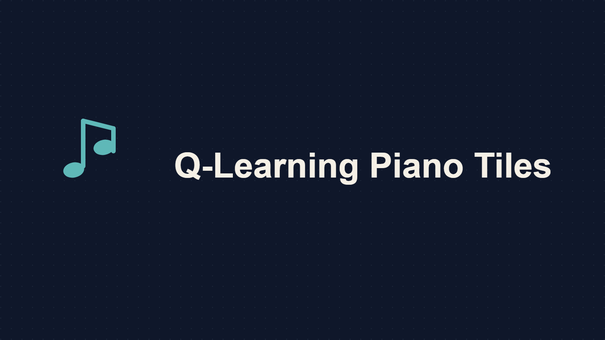
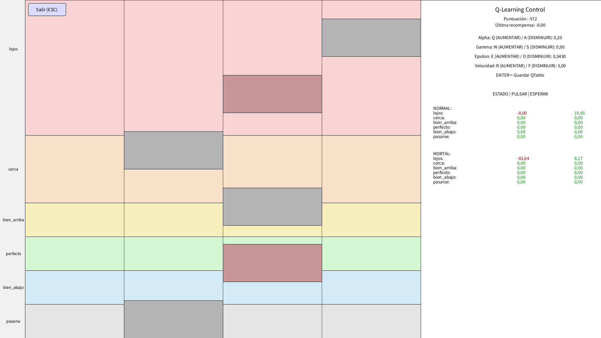
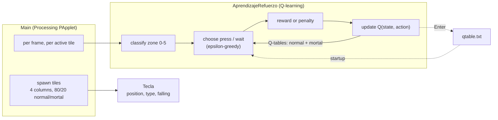

# Q-Learning Piano Tiles


A reinforcement-learning exercise: an agent that teaches itself to play a Piano-Tiles-style
reflex game. Tiles fall down four columns and the agent has to decide, frame by frame, whether
to press each one or let it keep falling. Nobody tells it the rules — it starts by pressing at
random and learns from the points it gains and loses.

Built for a DAM (software development) course module on reinforcement learning. The game itself
is drawn with [Processing 4](https://processing.org/); the learning is plain tabular Q-learning
written from scratch, no ML library.

## What it does

The screen is split in two. On the left, tiles fall and the agent plays. On the right, a live
panel shows the Q-table filling in and the current hyperparameters.

- **Two kinds of tile.** Normal tiles (80%) score points when pressed near the line. "Mortal"
  tiles (20%) must be left alone — pressing one is a heavy penalty.
- **Six zones.** Each tile's distance from the press line is bucketed into one of six zones,
  from *lejos* (far above) through *perfecto* to *pasarse* (fallen past). That bucket plus the
  tile type is the agent's state.
- **Two actions.** Press or wait. The agent keeps a separate Q-table for normal and mortal
  tiles, each six rows (zones) by two columns (actions).
- **It gets better while you watch.** Exploration (`epsilon`) decays 2% every 600 frames, so
  early on the agent flails and after a minute or two it starts hitting the *perfecto* zone and
  ignoring mortal tiles.

## Tune it live

While the agent is playing:

| Key | Effect |
|---|---|
| `Q` / `A` | learning rate `alpha` up / down |
| `W` / `S` | discount `gamma` up / down |
| `E` / `D` | exploration `epsilon` up / down |
| `R` / `F` | tile fall speed up / down |
| `Enter` | save the Q-table to `qtable.txt` |
| `Esc` | back to the menu |

`qtable.txt` is loaded on startup, so a saved agent picks up where it left off. The file in this
repo holds a lightly-trained table — delete it to start the agent from zero.

## Run it

Needs JDK 24 and Maven.

```bash
mvn -q compile exec:java -Dexec.mainClass=com.pianotiles.Main
```

The sketch opens full-screen. Processing pulls in JOGL/GlueGen native libraries through Maven on
first build, so the first compile takes a moment.

## Screenshots


:---:
Mid-run — the falling tiles on the left, the agent's Q-table and knobs on the right

## Architecture



See [ARCHITECTURE.md](./ARCHITECTURE.md) for the reward table and the update rule.

## Contributors

A group project for the DAM course. Handles are GitLab, where the coursework was hosted.

- **Daniel Adanegbe** (@dadanegbe) — lead
- **Yeray Yannel** (@yerayannel333)
- **Andres Rincon** (@barincon)
- **Pau Martin** (@martin.peralta.pau)

## License

PolyForm Noncommercial 1.0.0 ([LICENSE](./LICENSE)). Personal, non-commercial use only.
